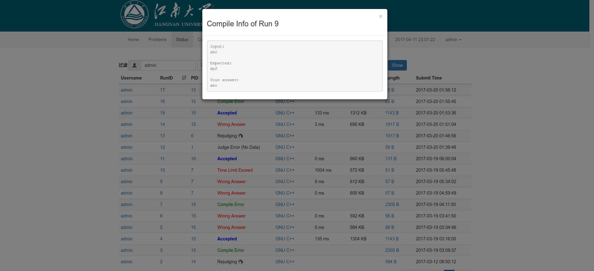
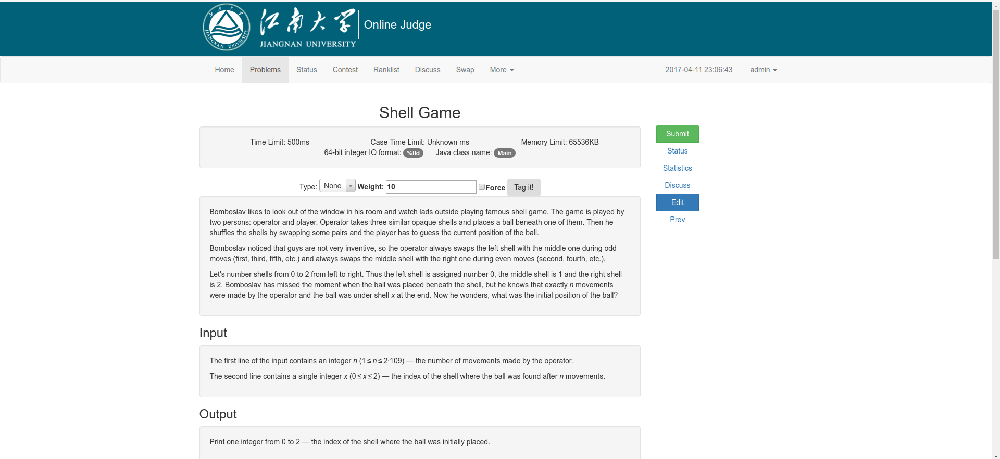

# 江南大学在线判题系统

> 基于 https://github.com/51isoft/bnuoj 开发

新增特性
-------
- 升级 bootstrap v2 为 bootstrap v3
- 重新设计页面
- 判题 Wrong Answer 时显示错误数据（目前尚未对大数据进行处理）
- 可以在网页上传测试数据（目前尚未支持打包上传）

文档
-------
- [安装教程](docs/install.md)

> 只是简单优化下。

