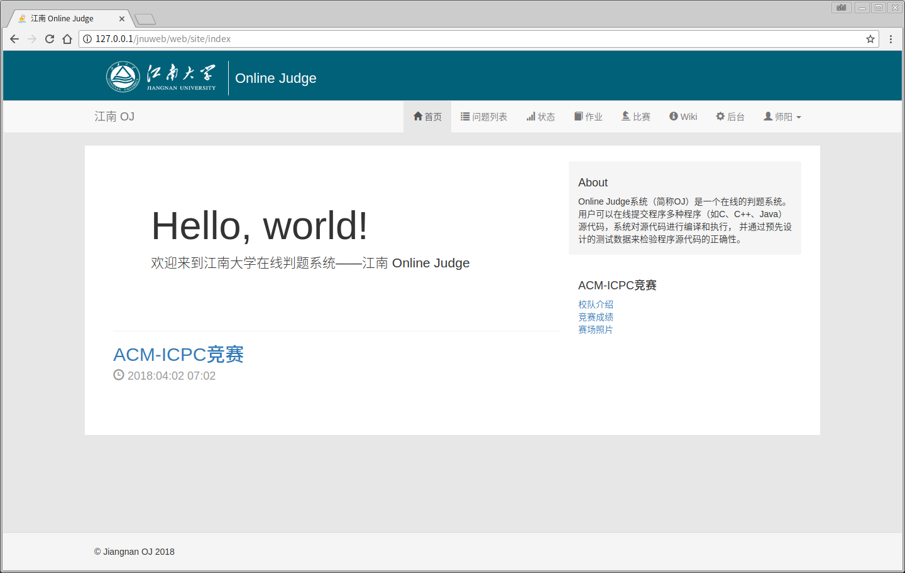
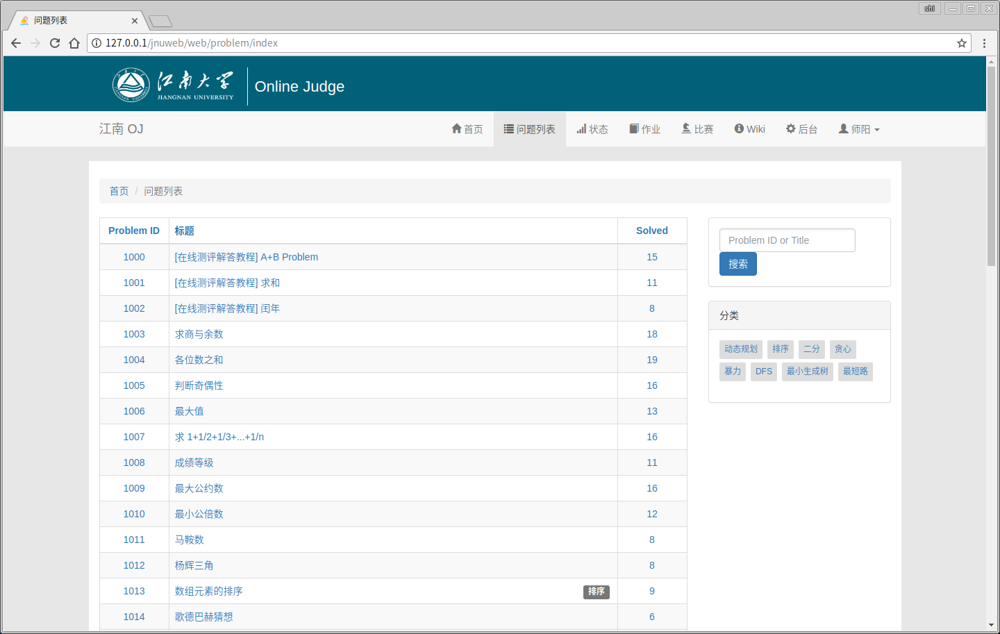
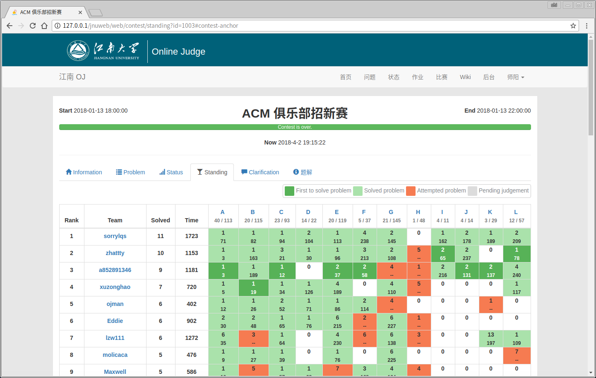
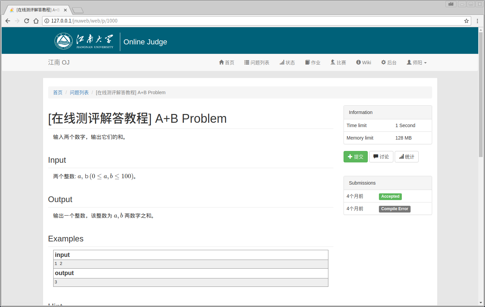

<p align="center">
    <a href="https://www.jnoj.org" target="_blank">
        
    </a>
    <h1 align="center">Jiangnan Online Judge</h1>
    <br>
</p>

江南在线评测系统（Jiangnan Online Judge），是一个在线的判题系统。
用户可以在线提交程序多种程序（如C、C++、Java）源代码，系统对源代码进行编译和执行， 并通过预先设计的测试数据来检验程序源代码的正确性。

功能特性
----------

- [x] 滚榜 - 在比赛结束后，提供滚动榜单的功能
- [x] 线上线下赛场景 - 为线下举办的比赛增加限制：如限制参加比赛的账户，参加比赛的账户不能自己修改个人信息
- [x] 线下赛打印功能 - 为线下赛提供打印代码的功能
- [x] 题目打印功能 - 创建比赛后，可以将题目信息一键导出为 PDF，以供打印。
- [x] 公告弹窗提示 - 在比赛过程中，发布公告时可以给所有在线用户发布弹窗提示有新公告
- [x] 作业 - 可以用于教学练习
- [x] 记录出错数据 - 可以查看提交方案的出错数据
- [x] 新闻门户首页 - 首页显示新闻，各种公告等
- [x] 支持多语言 - 现支持 C、C++、Java、Python3
- [x] 全站使用 Markdown 编辑器，支持 MathJax 数学公式
- [x] 题目描述多组样例 - 在一道题目的样例描述中，可以提供多组样例
- [x] 对比赛发布题解
- [x] 问题标签 - 给问题添加标签，方便查询
- [x] 基于 MVC 框架开发 - 开发便于上手
- [ ] 多边形出题系统 - 一个功能完善的出题系统。出题目，生成数据等。
- [ ] Web 在线管理题目数据 - 在线对题目测试数据进行增删改查
- [ ] 为后台添加管理员
- [ ] 排行榜 - 对用户解题数量等进行排行
- [ ] 积分榜 - 对参加比赛的用户进行积分结算，并进行排名
- [ ] 数据库备份
- [ ] 删除某道题的提交记录 - 可用于在比赛后发现某道题不合理，删除该题的提交记录


界面预览
---------








安装需求
------------

在 Linux 环境下安装。判题机是在 Linux 环境下写的，Windows 下无法运行判题机。

搭建 LAMP (或 LANP) 环境：PHP 7.x、MySQL、Apache2 / Nginx

安装额外的依赖：php-mbstring

安装过程
------------
1. 下载　`jnoj`
    提供两种方法下载：
    1. 运行命令：
        ~~~
        git clone https://github.com/shi-yang/jnoj.git
        ~~~
    2. 到　[https://github.com/shi-yang/jnoj/releases](https://github.com/shi-yang/jnoj/releases) 选择最新版本下载。

2. 配置 Web 端
    1. 配置数据库信息
    
        在 `config/db.php` 文件中配置数据库信息，例如:
        
        ```php
        return [
            'class' => 'yii\db\Connection',
            'dsn' => 'mysql:host=localhost;dbname=jnoj',
            'username' => 'root',
            'password' => '123456',
            'charset' => 'utf8',
        ];
        ```
        
        **注意：** Web 程序不会为你创建数据库，需要你自己手动创建该数据库。
        
    2. 安装 Web 相关依赖
        这里提供两种安装方法。一种是用 `composer` 来安装，另一种是通过压缩包来安装。
        1. 使用 `composer` 来安装。这种方法因国内网络问题，安装时间漫长或无法安装。需要先下载安装 `composer`。然后执行
        
            ```bash
            php composer.phar update
            ```
        2. 通过安装包来安装。到 [https://github.com/shi-yang/jnoj/releases](https://github.com/shi-yang/jnoj/releases)
        下载最新版的 `vendor.zip` 后，放在 `jnoj` 目录下，直接解压即可。然后依次运行下列命令修改目录权限：
            ```bash
            chmod 777 runtime
            chmod 777 web/assets
            chmod 777 web/uploads
            ```
        
    3. 导入数据库信息
        
        运行 `./yii migrate`。根据提示输入管理员账号密码邮箱。

    4. 启动 Socket 功能 (启动该功能是为了在发布公告时给前台用户弹窗提醒)
    
        运行 `php socket.php start -d`
    
    做好以上步骤后便使用 Web 端：
    
    ~~~
    http://localhost/jnoj/web/
    ~~~
    
    此时还不能进行判题，需配置判题机才能判题。
    
3. 配置判题机
    1. 创建一个用于判题的用户，运行命令：`useradd -m -u 1536 judge`
    2. 在 `judge/config.ini` 文件中配置数据库信息
    3. 将控制台切换到 `judge` 目录（即运行 `cd judge`命令），然后运行 `make` 命令
    4. 运行 `sudo ./dispatcher` 命令


开发者支持
---------
Issues: [https://github.com/shi-yang/jnoj/issues](https://github.com/shi-yang/jnoj/issues)

Wiki: [https://github.com/shi-yang/jnoj/wiki](https://github.com/shi-yang/jnoj/wiki)

QQ、微信：


目录结构
----------

      assets/             资源文件的定义
      commands/           控制台命令
      components/         Web 应用程序组件
      config/             Web 应用程序配置信息
      controllers/        控制器(Controller)文件
      docs/               文档目录
      judge/              判题机所在目录
      judge/data          判题数据目录
      mail/               发邮件时的视图模板
      messages/           多语言翻译
      migrations/         数据库迁移时的各种代码
      models/             模型(Model)文件
      modules/admin       Web 后台应用
      modules/polygon     多边形出题系统
      runtime/            Web 程序运行时生成的缓存
      tests/              各种测试
      vendor/             第三方依赖
      views/              视图(View)文件
      web/                Web 入口目录
      widgets/            各种插件
      socket.php          用于启动 Socket，提供消息通知功能
