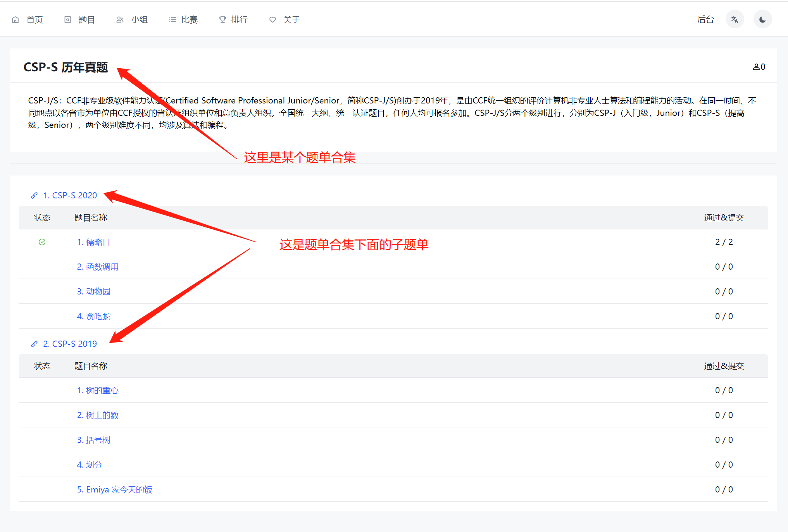
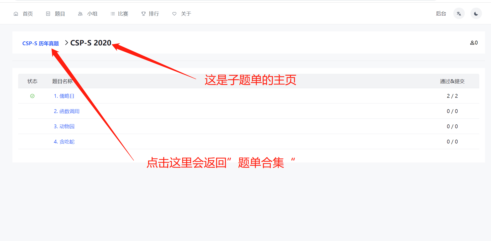
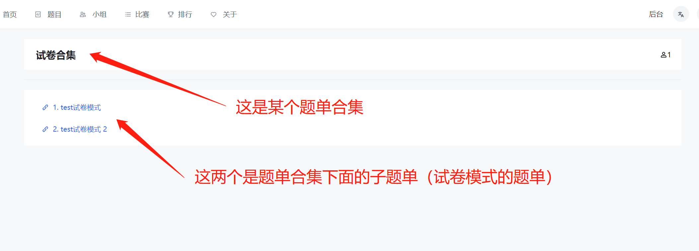
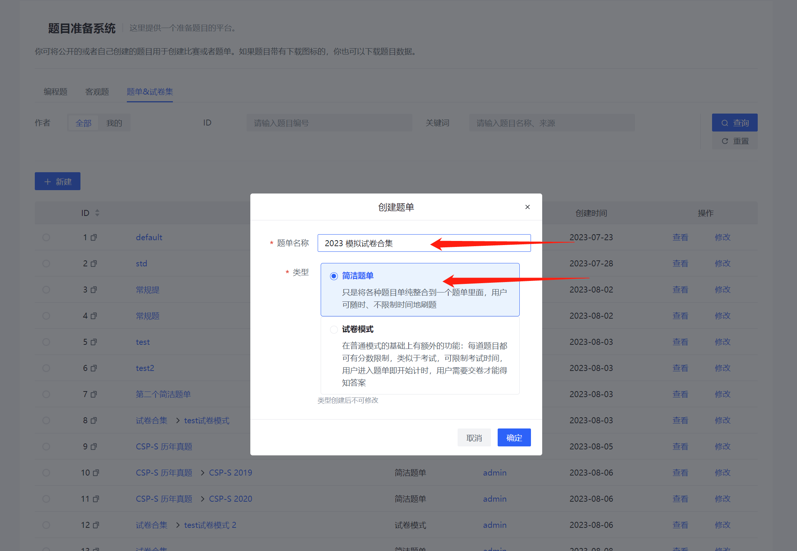
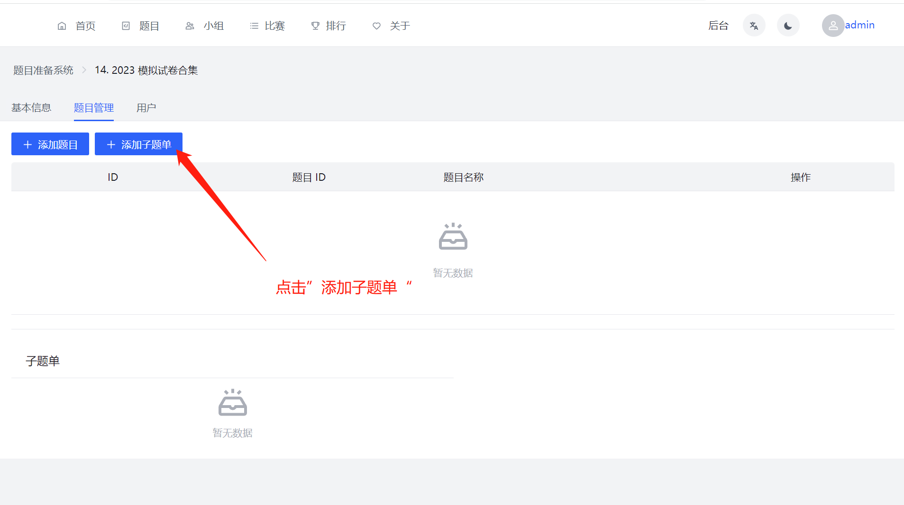
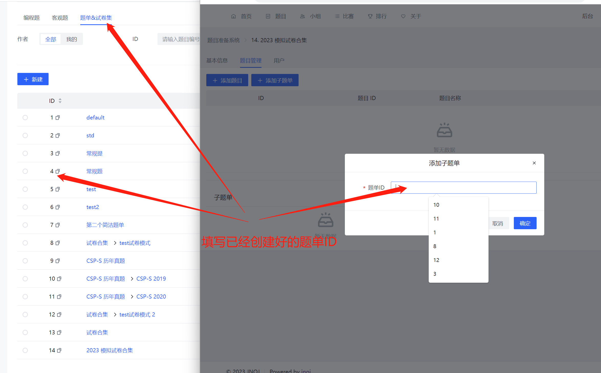
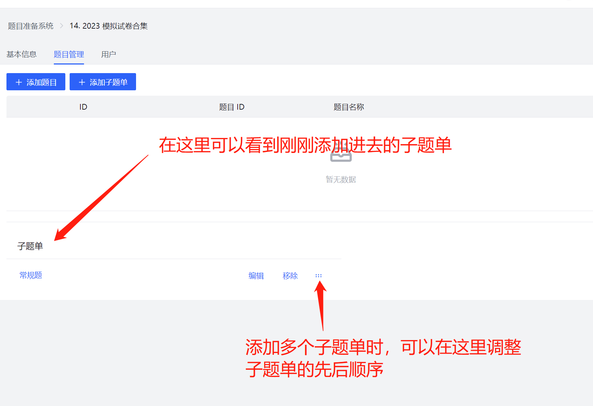

# 题单合集

题单合集用于归类同一大类、不同小类的题单。比如同样属于ICPC历年真题题目，也会分为2023年、2022年、2021年这样的子题单。
或者同一 2023年暑期集训中，也会分为模拟赛一、模拟赛二、模拟赛三这样的子题单。

如下图所示：

1. 基于编程题目的题单合集：

2. 基于试卷模式的题单合集：

## 题单合集的创建方式

#### 步骤1 先创建好子题单

#### 步骤2 按照如下步骤创建题单合集

##### 2.1 创建一个“简洁模式”的题单

##### 2.2 进入新创建的题单页面，切换到“题目”选项卡，点击“添加子题单”

##### 2.3 在弹出的新页面中，添加需要加进来的子题单ID

##### 2.4 即可完成题单合集

## 相关说明

#### 1. “题单合集” 本质就是一个“简洁模式”的题单。“题单合集”与“子题单”的关系相当于数据结构中的“父-子”节点。且最多也只有“父-子”二级关系，没有三级、四级关系。

#### 2. “题单合集”可同时包含“简洁模式”的子题单和“试卷模式”的子题单，用户在查看题单合集页面时，针对“简洁模式”的子题单会显示所有的题目名称，针对“试卷模式”的子题单只会显示子题单名称。

#### 3. 某个题单，只能作为一个“题单合集”的子题单，不能作为不同“题单合集”的子题单（即一个孩子不能同时拥有两个父亲）。

#### 4. 关于权限：在题单合集和子题单两者的刷题资格均需为邀请码的情况下，如果用户加入了题单合集，则有权限访问其下所有的子题单。如果某个子题单的刷题资格为“允许任何人”，则无论“题单合集”限制刷题权限与否，用户均可通过链接刷子题单的题目。